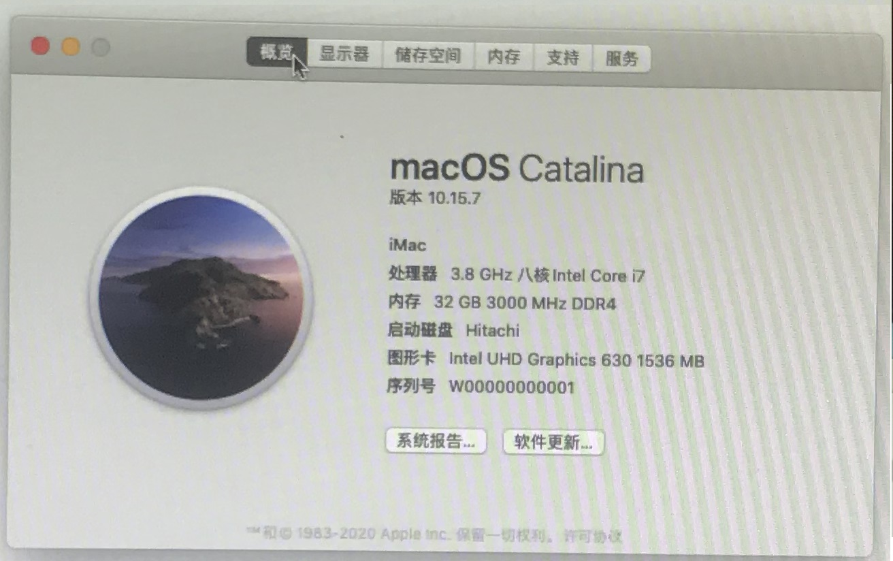

# Hackintosh-I7-10700k-ASUS-z490-p（undone）
半成品的丐版黑苹果哈哈哈哈

# 写在前面

这是半成品的EFI，目前硬件还没有完全买好，只是验证了在以下硬件可以跑黑苹果，嘻嘻。

等完全买好了硬件再更新EFI上来

# 已经验证了哪些功能可以正常工作？

1.有线网卡

2.CPU核心显卡 - HDMI接口

# 哪些功能还没有验证？

1.板载声卡

2.前置USB

3.前置音频口

# 硬件
CPU： Intel i7-10700k

主板： 华硕ASUS z490-p

内存： 海盗船DDR4 3000Mhz 32G x 1

显卡： CPU核心显卡UHD630

硬盘： 日立250G SATA

散热： 大霜塔标准版

网卡： 板载有线网卡

声卡： 板载声卡

电源： 海盗船RMx650 金牌650W

机箱： 无

# BIOS设置

Z490通用 BIOS 设置教程设置你的 BIOS，虽然Z490-P的界面跟教程中的不一样，但是配置项基本相同，在线查看教程地址 http://note.youdao.com/s/GheI2WN7  

# 下一步计划攒钱买

1. 三星970evo M2接口固态硬盘 1TB

2. 三星 4k显示器

3. 蓝宝石AMD rx580 显卡 （显卡好贵，啥时候才能300买580?）

4. 机箱

# 为什么要选择丐版的z490-p？

因为听远景的大佬们说板载的WIFI芯片一般很难直接驱动起来的，那我心想那就买一块没有带WIFI芯片的板子好了

